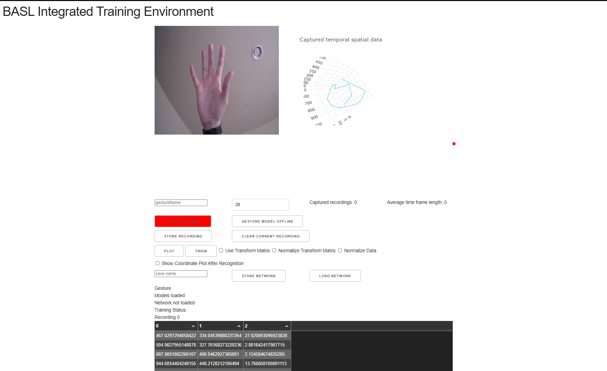

# Gesture Tracking with BASL

## Project Purpose

BASL (Blended Assistive Signaling Language)  was created to address the current need of reducing contact and spread of viruses during the pandemic. The client requested a touchless interface that could be added to the current kiosk based system with minimal development. Additionally, it was of utmost importance to maintain the ability to train a model to recognize custom gestures. 

The final product includes a web based training environment and demo site showing BASL gesture tracking in real-time. 

Due to time and hardware limitations, the gesture recognition model was trained on a small dataset of idle vs circular motion information. The dataset was sufficient to demonstrate the model in action.

---

## Application Benefits

Having a method of interacting with a target system using gestures and motion ensures users will not need to worry about the possibility of spreading or coming into contact with surface dwelling bacterial viruses. 

Utilizing a packaged complete solution will save the business time and money when the need to add touchless features to other products are needed.

---

## Objective and Hypothesis

The objective is to create a neural network that will classify a motion gesture based on an input datum that encodes the necessary temporal spatial information of said gesture.

If motion gestures over time can be reduced to a series of discrete linear transformations then subsequent training and generalization of a motion gesture classification can be automated. This automation will be based on simulated input rather than actual gesture information derived from processing video data.

## Hypothesis Verification

The objective was to create a neural network that would classify a motion gesture based on an input datum that encodes the necessary temporal spatial information of said gesture.

Results were positive in demonstrating classification of both a static hand position and circular motion. However, due to the nosiness of real world captured data, further investigation is needed on generating simulated input. With more time and further research, the current trend suggests that it is possible to train without capturing and processing video.

---

## Datasets

The datasets were created from captured video that was fed into a hand and joint classifier. Each frame classified resulted in a coordinate pair which was then combined with subsequent frames to encode a specific motion. The data from frames that were not recognized were discarded from the data set, following a preprocessing step of normalization. The newly processed data was then given a label based on what gesture was being trained, in this case, circular motion. 

## BASL Integrated Training Environment (BITE)
In order to simplify the process of data collection, classification, and training, a web interface was created. This training environment includes a super set of the BASL source code and allows for loading, saving and training neural networks. The components of the tool allow for real time display of the captured data before training and lets the user test the network as it improves. Upon successful training and verification the model may be exported and be included in the basic BASL source code.

## Contributors

Big thanks to Katarina Mestas and Analise Leiva who both provided much support in the late and early hours of this project.

### [Katarina Mestas](https://www.linkedin.com/in/katarinamestas/) - Data collection using BITE.

### [Analise Leiva](https://www.linkedin.com/in/analise-leiva) - Demo site's user interface and experience design. 

